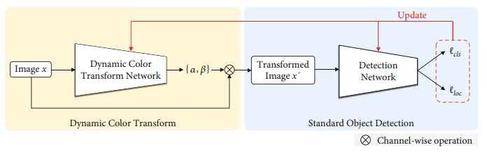

# DCT

This repository includes the official implementation of the paper:

**[Dynamic Color Transform Networks for Wheat Head Detection](https://downloads.spj.sciencemag.org/plantphenomics/2022/9818452.pdf)**

Plant Phenomics, 2022

& **[Dynamic Color Transform for Wheat Head Detection](https://openaccess.thecvf.com/content/ICCV2021W/CVPPA/papers/Liu_Dynamic_Color_Transform_for_Wheat_Head_Detection_ICCVW_2021_paper.pdf)**

International Conference on Computer Vision Workshops (ICCVW), 2021

Chengxin Liu, Kewei Wang, Hao Lu, Zhiguo Cao

Huazhong University of Science and Technology, China

## Highlights

- DCT is intuitive and steerable
- We won 2nd Place in [Global Wheat Challenge 2021](https://www.aicrowd.com/challenges/global-wheat-challenge-2021) based on DCT
- DCT is also applicable to other vision tasks, e.g., crowd counting



## Installation

[](https://www.python.org/)
[](https://pytorch.org/)

- Set up environment

```
# env
conda create -n dct python=3.7
conda activate dct

# install pytorch
conda install pytorch==1.10.0 torchvision==0.11.0 -c pytorch -c conda-forge
```

- Install 

```
# clone 
git clone https://github.com/cxliu0/DCT.git
cd DCT

# install dependecies
pip install -r requirements/build.txt

```

## Data Preparation

- Download [Global Wheat Head Detection Dataset 2021 (GWHD 2021)](https://www.kaggle.com/datasets/bendvd/global-wheat-challenge-2021). We expect the directory structure to be as follows:

```
DCT
├── data
│    ├── gwhd_2021
│         ├── images
│         ├── competition_test.csv
│         ├── competition_train.csv
│         ├── competition_val.csv
├── configs
├── models
├── ...
```

- Preprocess data

```
python preprocess_data.py
```

- Download pretrained [yolov4-p7 model](https://drive.google.com/file/d/18fGlzgEJTkUEiBG4hW00pyedJKNnYLP3/view?usp=sharing) and put it into ```./pretrained/```


## Training

We follow a two-step training strategy.

- Step 1: train a baseline Scaled-YOLOv4 model

```
sh train_baseline.sh
```


- Step 2: fix the weights of the baseline model, and train DCT:

```
sh train_dct.sh
```


## Evaluation

We implement the evaluation of ADA following [Global Wheat Challenge 2021 (GWC 2021)](https://www.aicrowd.com/challenges/global-wheat-challenge-2021). Note that the tested ADA in this repository seems slightly lower than the official one.

- Modify test_ADA.sh

```weights```: modify it to the path of your locally trained model

- Run
```
sh test_ADA.sh
```

## Pretrained models (Tested on the GWHD 2021 Dataset)

We also provide pretrained DCT models. You can download the models if you do not want to train DCT.

|       DCT Type     |    DCT Arch     |    Val  ADA    |    Test ADA    |  Weights  |
| :----------------: | :-------------: | :------------: | :------------: | :-------: | 
|     Regression     |     ResNet18    |     0.787      |     0.629      | [regDCT.pt](https://drive.google.com/file/d/1Q0YqpJticAv2e_zxhovyOBc8HMwHU7gB/view?usp=sharing)  |
|    Classification  |     ResNet18    |     0.782      |     0.630      | [clsDCT.pt](https://drive.google.com/file/d/1v6fxjvhyPFV_x7r59UC2Pl6zUhKkKHR8/view?usp=sharing)  |

## Citation

If you find this work or code useful for your research, please consider citing:
```
@article{liu2022dct,
  title = {Dynamic Color Transform Networks for Wheat Head Detection},
  author = {Chengxin Liu  and Kewei Wang  and Hao Lu  and Zhiguo Cao },
  journal = {Plant Phenomics},
  year={2022}
}

@INPROCEEDINGS{liu2021dct,
  author={Liu, Chengxin and Wang, Kewei and Lu, Hao and Cao, Zhiguo},
  booktitle={Proceedings of the IEEE/CVF International Conference on Computer Vision Workshops (ICCVW)}, 
  title={Dynamic Color Transform for Wheat Head Detection}, 
  year={2021},
  pages={1278-1283},
}

```

## Acknowledgment

This repository is based on [Scaled-YOLOv4](https://github.com/WongKinYiu/ScaledYOLOv4).
